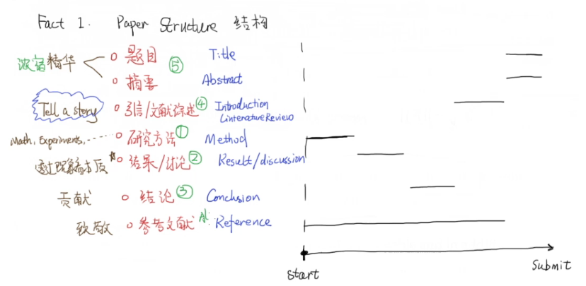
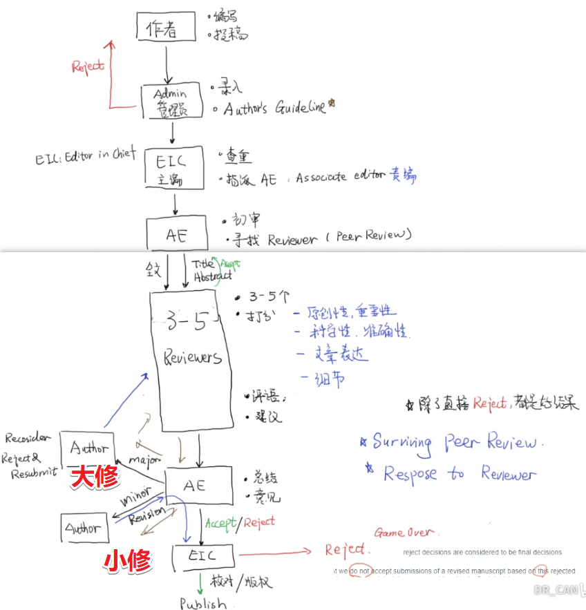
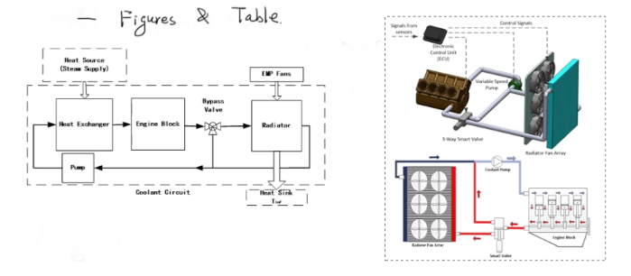
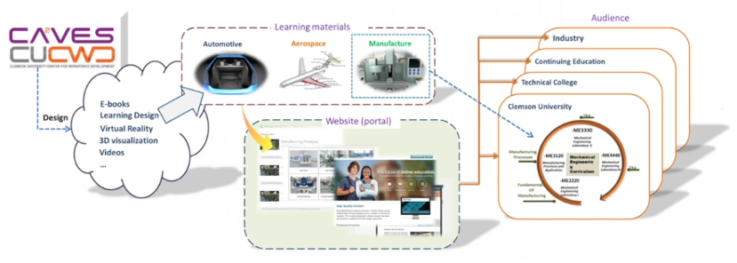
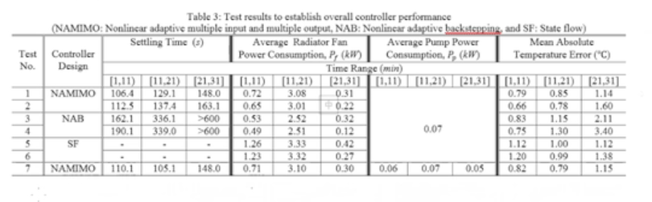

# 期刊审稿人手把手教你写一篇SCI论文 (1)_事实汇总【论文写作】

<!-- @import "[TOC]" {cmd="toc" depthFrom=3 depthTo=6 orderedList=false} -->

<!-- code_chunk_output -->

- [博主背景](#博主背景)
- [文章结构 Paper Structure](#文章结构-paper-structure)
- [如果写文章，该是什么顺序？](#如果写文章该是什么顺序)
- [【重要】论文投出去会经历什么？](#重要论文投出去会经历什么)
- [文章的第一印象（审稿人第一眼会看什么？）](#文章的第一印象审稿人第一眼会看什么)

<!-- /code_chunk_output -->

### 博主背景

-PHD of Dynamics and Control, 机械工程系, 克莱姆森大学
- 作者工作偏应用
- 在 ABB 工作

### 文章结构 Paper Structure

- **题目 Title** 是浓缩的精华
- **摘要 Abstract** 是浓缩的精华
- **引言/文献综述 Introduction/Literature Review** tell a story
- **研究方法 Method** Math, Experiments
- **结果/讨论 Result/Discussion** 透过现象看本质
- **结论 Conclusion** 贡献
- **参考文献 Reference** 致敬

### 如果写文章，该是什么顺序？

首先从 `研究方法` 入手，接着自然而然进入 `结论` 部分，在这个过程中保持 `文献阅读` 量，最终将其转换为 `引言`，最终提交前精雕细琢题目与摘要。

### 【重要】论文投出去会经历什么？

经验：
- 第一轮除了 `Reject` 都是好结果
- 这里有很重要的问题，就是如何回答审稿人？`Surving Peer Review / Response to Reviewer`

### 文章的第一印象（审稿人第一眼会看什么？）

**图和表格要好看。**

如上两幅图说的是同一回事，但是博主喜欢右侧的。

如上两个都是正面例子，说明有很强的背景和数据在背后做支撑。

**然后他们看引文。**

首先数量要适中，8 - 12 页的文献一般要参考 20 篇文献。其次时间要新，否则给人感觉没有跟进最新进展。
