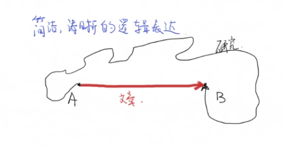
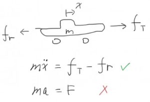

# 期刊审稿人手把手教你写一篇SCI论文 (3)_引言Methodology【论文写作】

<!-- @import "[TOC]" {cmd="toc" depthFrom=3 depthTo=6 orderedList=false} -->

<!-- code_chunk_output -->

- [研究方法概述](#研究方法概述)
- [研究方法的主旨](#研究方法的主旨)
- [如何写：照猫画虎](#如何写照猫画虎)
- [注意事项](#注意事项)

<!-- /code_chunk_output -->

### 研究方法概述

研究方法应该是最开始动笔的部分。

研究方法好写在于：言之有物，相当于科研的流水账。

研究方法不好写在于：要把研究内容写清楚，把 contribution 写明白。

不同类型的文章研究方法侧重不同：
- 理论文章中，侧重于推导过程
- 实证文章中，侧重于调查方法、数据处理
- 工程应用文章中，则是侧重于把理论运用到实践

### 研究方法的主旨

研究方法的主要目的是什么？
- **向读者解释说明作者是如何得到结果的**
- 即，在条件允许下，读者可以重现结果，包括数学模型、模拟结果、实验结果

因此，研究方法中应该提供足够的、准确的技术细节。

因此研究方法应该包含假设、数学推导、验证、实验设备。

注意，**研究方法应该是简洁清晰的逻辑表达。**

如上，在研究中，我们的路径可能是曲折痛苦的，但是在论文中，这个过程应该是风淡云清、笔直有力的。

### 如何写：照猫画虎

写法参考同领域其他文章。

讲授者以自己的控制类应用文章举例： `II. MATHEMATICAL MODELS` 第二章数学模型、 `III. CONTROL STRATEGIES` 第三章控制器建立以及 `IV. EXPERIMENTAL TEST BENCH` 第四章实验设备都属于研究方法。

在数学模型中：
- 第一段说明数学模型要做什么
- 罗列假设
- 接下来一步步建立起系统动态数学模型

在控制方法中：
- 提出了多输入多输出系统
- 做稳定性分析（这就是前文图片中从 `A` 到 `B` 的路，虽然作者在推导过程中并不是这个顺序，但是在文章中直接给出答案以及证明）
- 参考值的选取和输入的调整

最后在实验设备中介绍实验的器材和系统。

### 注意事项

一是，符号命名的一致性，可以考虑在一开始建立 `NOMENCLATURE` 表格统一符号。

在符号第一次出现时需要描述 `description` 。

二是，公式的编号。

在数学推到中，经常出现 `substitue Eq. () into Eq. ()` ，如果用 LaTex 编辑，会自动更新，但是如果其他软件，则要小心。

**不注意上面这两点（符号的乱用和错误的公式编号）可能会导致你的文章直接被 reject 掉。**

第三，不要灌水。灌水包括：
- 不要加入无关内容，比如没有关系的公式、背景
- 不要加入基础内容，比如下图的自动巡航系统

车受到牵引力和摩擦里，则无需出现 $f=ma$ 这样特别基础的公式。
