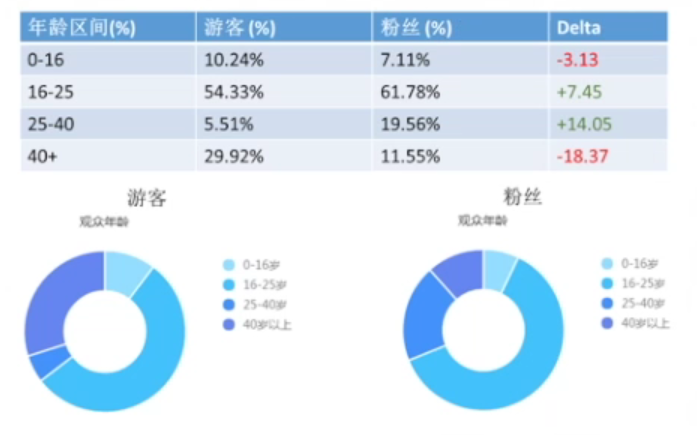

# 期刊审稿人手把手教你写一篇SCI论文 (4)_结果与讨论Result and Discussion【论文写作】

<!-- @import "[TOC]" {cmd="toc" depthFrom=3 depthTo=6 orderedList=false} -->

<!-- code_chunk_output -->

- [结果与讨论是核心](#结果与讨论是核心)
- [入门模板](#入门模板)
  - [描述结果](#描述结果)
  - [分析结果](#分析结果)
  - [讨论结果（Critical Thinking）](#讨论结果critical-thinking)

<!-- /code_chunk_output -->

### 结果与讨论是核心

讲者眼中，有些教授堪称“文学巨匠”：在常人看来平平无奇的结果，往往在他们手中就可以妙笔生花、点石成金。

**实际上，能成为“文学巨匠”，是因为学术水平很高。**

举例，以下三种表达的都是同一件事：
- 明月松间照，清泉石上流（王维）
- 树上的月亮它又大又圆，树下的泉水它又清又甜
- 我X，这月亮真XX大

这不止是语言的文字游戏，比如王维能写出这两句诗，是因为他注意到了明暗结合、动静相衬的特点。

类比到学术研究中，同样的结果，能观察到不同的内容、写出不同的东西，实际上反映出来的就是水平的高低。

培养这种能力需要大量的科研、阅读、写作、科学训练。

### 入门模板

本模板的模式为：结果+讨论，分为3步。

第一步：描述结果。包括视觉和图表（下次课讲）、语言。

第二步：分析结果。

第三步：讨论结果。

例子为B站UP主粉丝统计：

#### 描述结果

> 统计结果表明，关注DR_CAN视频的主要人群年龄在16岁到25岁之间，占总粉丝人数的61.78%，随后是25到40岁的人群和40岁以上的观众。最少的是16岁以下的观众，这部分只占到总关注人数的7.11%。

如上是对于第三列的描述，用了`定量`（`61.78%, 7.11%`）+`定性`（`主要人群, 随后是, 最少的是`）描述。

#### 分析结果

> Up主讲解的内容涉及了现代控制理论，非线性控制理论，动态系统分析等等，属于专业性比较强的课程，会出现在本科高年级以及研究生的课堂上。在我国，18岁到25岁这个年龄段涵盖了大部分的本科和硕士研究生。另一方面，16岁以下的人群基本属于高中阶段以下，这个年龄段的同学还在学习通用的基础课程。此外，up主的视频当中用到了高等数学，线性代数，复变函数等数学工具，这些数学基础都是大一或者大二的课程，对于16岁以下的人群来，接触的机会比较少。

如上的分析，用到了两种方法：
- `论证`：比如前半部分（专业性很强->本科研究生较多）
- `对比`：后半部分比较了两个年龄段的区别

#### 讨论结果（Critical Thinking）

> 这一年龄结构的统计数据验证了UP主做视频的初衷，视频的主要受众人群是高年级本科生，硕士博士研究生。半数以上的关注人群来自这一年龄 段也同时证明了up主的作品内容没有跑偏。相信保持这样的内容和质量，这一数据将得到巩固。因为每年都会有新的学生接触到这一课题。 而另一方面，有70多个(7. 11%) 16岁以下的观众关注了UP主的视频，这可能是因为有些网友在注册时没有使用正确的身份信息。有很多的网友都会选择注册当天作为自己的生日信息。

如上讨论包含三个层面：
- `意义`：比如“验证了UP主做视频的初衷”，对于工程类文章可能是“验证了算法的准确性”
- `展望`： **是对现有结果的扩展（future）。** 比如“每年都会有新的学生接触到这一课题”。
- `猜想和假设`： **面对一些结果中看上去不那么争取的结果，不要去回避（审稿人也不会视而不见）。** 要尝试自圆其说，给出猜想和假设。
