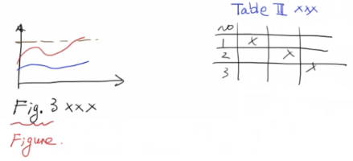
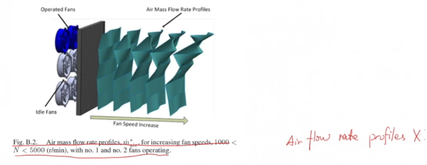
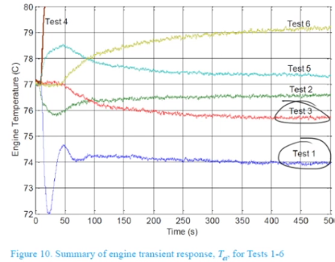
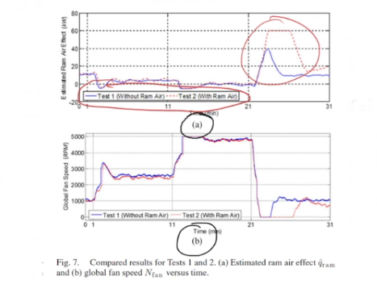

# 期刊审稿人手把手教你写一篇SCI论文 (5)_图和表Figure and Table【论文写作】

<!-- @import "[TOC]" {cmd="toc" depthFrom=3 depthTo=6 orderedList=false} -->

<!-- code_chunk_output -->

- [图和表决定第一印象](#图和表决定第一印象)
- [参考Auther's Guide](#参考authers-guide)
- [图表必须在文中提到](#图表必须在文中提到)
- [引用图标标号](#引用图标标号)
- [Consistancy 一致性](#consistancy-一致性)
- [标题清晰、准确、完整](#标题清晰-准确-完整)
- [用颜色和图列区分多的数据](#用颜色和图列区分多的数据)
- [使用副标题](#使用副标题)
- [杜绝一图多投](#杜绝一图多投)
- [保留原始数据](#保留原始数据)

<!-- /code_chunk_output -->

### 图和表决定第一印象

图和表是审稿人第一时间浏览到的内容，决定了审稿人对你文章的第一印象。

本次课的目标是在 Reviewer 指出之前将问题发现并解决。

### 参考Auther's Guide

要参考期刊的 Auther's Guide ，如果有模板 `template` 要下载下来。

一般来讲：
- 图用阿拉伯数字，表格用罗马数字
- 图的标题在下面，表格的标题在上面
- 注意是要写 `Fig` 还是 `Figure`

### 图表必须在文中提到

注意必须 `MUST` 提到，尤其是要检查 Introduction 部分的概念图。

### 引用图标标号

要有 Refer to Number(标号) ，比如：
- According to Fig.5, XXX
- Table III indicates XXX

不要写成：
- The above figure XXX
- Refer to the table on the left

同样，是 `Fig` 还是 `Figure` 要和图表保持一致

### Consistancy 一致性

图表中的表达方式要与论文中一致：
- 检查符号单位
- 比如 `kW` 是在图表斜体，则文章中也必须是斜体

### 标题清晰、准确、完整

标题 Caption 一定要能够 Self-explanatory ，**不要担心过长** 。

### 用颜色和图列区分多的数据

要考虑黑白打印，因此颜色和图例要同时使用。

比如上图，颜色不同，且标注了图例。

不要试图隐藏不好的结果，其实尤其是不好的结果才是值得讨论的部分。

### 使用副标题

### 杜绝一图多投

即便非要引用自己投过的图，也必须加引用。不要给未来的自己添麻烦。

### 保留原始数据

保留好原始数据。
