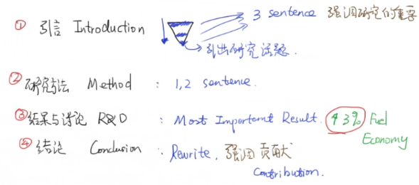
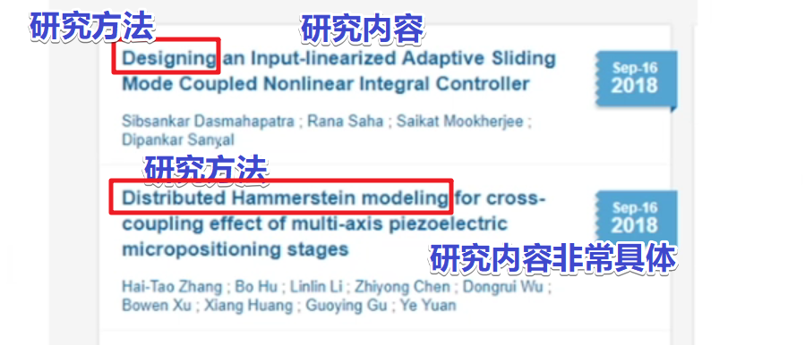

# 期刊审稿人手把手教你写一篇SCI论文 (6)_结论，摘要与题目Conclusion, Abstract, and Title【论文写作】

<!-- @import "[TOC]" {cmd="toc" depthFrom=3 depthTo=6 orderedList=false} -->

<!-- code_chunk_output -->

- [结论 Conclusion](#结论-conclusion)
- [摘要和题目 Abstract & Title](#摘要和题目-abstract-title)
  - [摘要（摘取要点）](#摘要摘取要点)
  - [题目](#题目)

<!-- /code_chunk_output -->

### 结论 Conclusion

讲者建议的动笔顺序中，结论部分出现在结果与讨论后，一般来讲是对其的总结，一到两段就可以。

`Start with`：`This paper investigate (Topic) using (Method)` ，开头一句话把 **研究方法和主题** 写明。要注意：
- 不要重复 Result
- 写清楚 Discover 发现、 Extension 扩展、 Future Plan未来，实际上就是把 `Result & Discussion` 中的 `Discussion` 汇总在一起。
- 不要简单的 `Copy & Paste` ，不要对前文简单的复制粘贴。

可以去 [thesaurus.com](https://www.thesaurus.com/) 帮助你去替换一些同义词。

此外，结论部分要强调你的贡献 `Contribution` ，要和引言部分 `Introduction` 相对应。

### 摘要和题目 Abstract & Title

要注意，这是搜索引擎返回的内容，因此要准确，拒绝文不对题。

#### 摘要（摘取要点）

从引言 `Introduction` 、研究方法 `Method` 、结果与讨论 `R&D` 以及结论 `Conclusion` 每部分摘一点，就是摘要。

- （1）引言的写作就是一个倒放的金字塔，从宏观背景到引出研究的话题，**我们从金字塔三个层次中各取出一句话，来强调研究的重要性。**
- （2）研究方法用一两句话来描述。
- （3）结果与讨论将最重要的内容展示。
- （4）对于结论，再重写一遍，强调贡献。

总结：（2, 3）说明了做了什么，（1, 4）强调了贡献和重要性。

#### 题目

包含：
- 研究内容 Topic
- 研究方法 Method
- 也可以包含一些研究结果，可以隐含地表示，比如（`Improvement` / `Reduce`）

题目的基本原则就是包含所有关键词。

举例如下：

