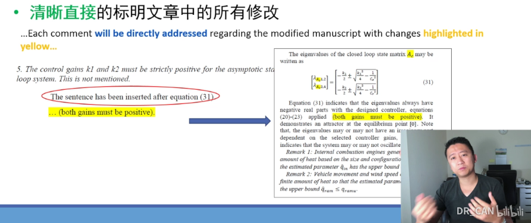

# 期刊审稿人手把手教你写一篇SCI论文 (6)_如何回复审稿人＋总结＋两位牛人的建议【论文写作】

<!-- @import "[TOC]" {cmd="toc" depthFrom=3 depthTo=6 orderedList=false} -->

<!-- code_chunk_output -->

- [回复审稿人重要原则](#回复审稿人重要原则)
- [本期邀请嘉宾](#本期邀请嘉宾)
- [作为作者：有哪一类问题是很多审稿人都会提出来的？](#作为作者有哪一类问题是很多审稿人都会提出来的)
- [遇到过最难回答的问题？如何回答的？](#遇到过最难回答的问题如何回答的)
- [一般回复需要花多久时间？](#一般回复需要花多久时间)
- [作为审稿人：必问的问题是什么？](#作为审稿人必问的问题是什么)
- [文章中什么现象会让你直接拒稿？](#文章中什么现象会让你直接拒稿)
- [会对什么样的文章好感度爆膨](#会对什么样的文章好感度爆膨)
- [关于怼回去](#关于怼回去)

<!-- /code_chunk_output -->

### 回复审稿人重要原则

- **调整心态：休息一天** 可能收到不好的反馈，不要马上反馈，避免一些情绪化的行为
  - 收到大修，依然会有 `>50%` 的成功机会
  - 审稿人是你的朋友，而不是你的敌人
- **逐一回答每一天意见** 讲者回复3个审稿人用了15页纸
- **清晰直接地标明文章中的所有修改**
- **礼貌、客气** Peer 
  - Review 没有报酬，懂得感激编委和评审的时间 `The co-authors and I would like to thank you for the time and effort spent in reviewing the manuscript`
  - 同意：表示赞同 `The authors would like to thank the reviewer for the suggestion, ...` `The authors would like to thank the reviewer's comment on this problem` （不要每一天都回复，这样显得回复比较廉价）
  - 不同意：委婉表达，尽量不要怼回去 `The reviewer's statement is correct in that ... However, the authors wish to ...` `corresponding work in the near future and will publish it at a later time` `The reviewer's comment is very useful and profound. However, the current effort ...`

### 本期邀请嘉宾

- 陶博士， FCA ，新能源电池研发
- 朱博士， NYU ，纳米材料方向

### 作为作者：有哪一类问题是很多审稿人都会提出来的？

Tao：
- 文字格式，图表样式的修改意见
- 整个文章的研究背景，涉及文章 `abstract` ， `introduction` 和 `conclusion` 的修改

Zhu：
- 审稿人会提出添加引用文献的要求，分两种：
  - 忽略了一些比较重要的工作，慎重地对待，加入相关讨论（让审稿人觉得自己的意见得到尊重）
  - 希望作者把自己的工作引用进去，文献几乎都是出自同一批作者

### 遇到过最难回答的问题？如何回答的？

Tao：
- 创新型相关的问题：内容有人做过，方法虽然新，没有实验数据支持
- 要求作者与导师深入探讨，回顾自己在研究过程中的结论并发掘价值

Zhu：
- 实验细节问题
  - 加补实验
  - 如果实验因为客观原因不能完成?
    - 尽量设计其他方案提供其他的实验结果来解释审稿人的问题
    - 实验困难（比如有文献说明）无法实现
    - 其他证据已经能够证明我们文中提出的观点

### 一般回复需要花多久时间？

Tao：
- 一周到一个月不等
- 如果部分研究工作需要大的修改，更长的时间

Zhu：
- 不需要补充实验的话，回复审稿意见1-2周
- 见过物理专业一篇nature子刊从一开始投稿到最终接受间隔五年的

### 作为审稿人：必问的问题是什么？

Tao：
- 文章背景相关的问题
- 整个领域的贡献
- 与重要的文献的关系、比较

Zhu：
- 会浏览一下文章的图，带着问题去读这篇文章
- 文章的 `novelty`
- 很多作者不重视 `Introduction` 部分
- 实验的细节问题
- 结果讨论中说的每一句话都应该有实验数据或者已发表的其他工作作为证据

### 文章中什么现象会让你直接拒稿？

Tao：
- 明显的数学、工程常识错误
- 明显的剽窃
- 错字措词过多，图表潦草

Zhu：
- 一稿多投、数据雷同的肯定拒
- 声称没有人用过的方法是不是确实没有人用过
- 图片信息量不足、灌水的
- 明显不专业的表现

### 会对什么样的文章好感度爆膨

Tao：
- 描述问题清楚，方法记录有逻辑并全面
- 算式格式标准，图表数据清晰
- 模拟实验具备

Zhu：
- 图片整齐信息量足，逻辑清晰，证据确凿，能够自圆其说
- 对于返修稿，重看作者有没有认真的尽力按审稿人的要求修改
  - “我是抱着挑刺的心理去读的，却发现这个作者是带着我走的，读了第一段，看了他第一幅图的`data`，心中会产生一个疑问， 但马上第二段他就拿出数据解释了我的疑问。然后我又产生了一个新的疑问，结果在第三段里就用数据解释了我的新疑问，就一直这样循环，直到最后读完最后一段，我觉得我的疑惑都被解释清楚了，没啥好问的了”

### 关于怼回去

Zhu：
- 一般出现在要求很高的好杂志，审稿人会吹毛求疵、随意拒稿
- 怼回去的基本前提，**要看编辑的态度，如果编辑欣赏你的工作，就可以怼回去**
- 把所有审稿人提出的合理审稿意见都认真回答好，补充数据把指出的漏洞补上
- 对于那些明显不合理的审稿人（只批评没建议），结合其他审稿人的意见来怼一下
- 结合其他审稿人的正面意见来反驳该审稿人的攻击不合理
- 抓住这个不合理审稿人意见中的明显漏洞
- 礼貌但不谦卑。反驳，不是吵架。
